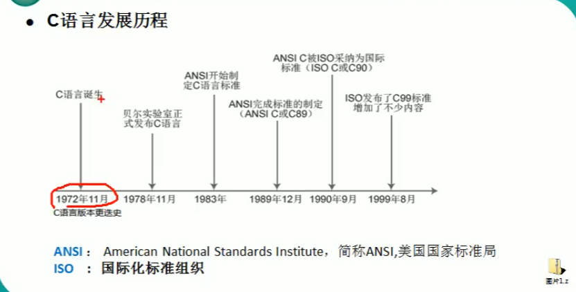
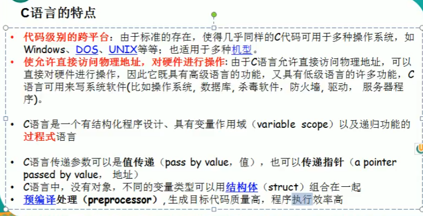
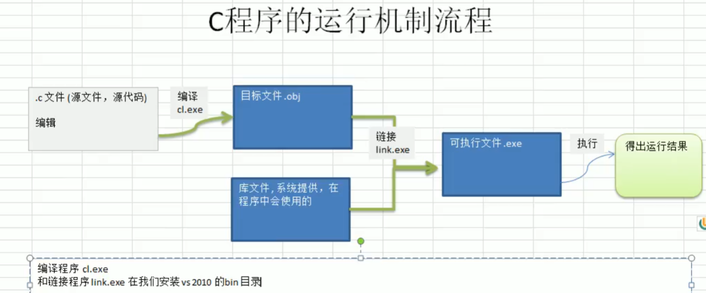
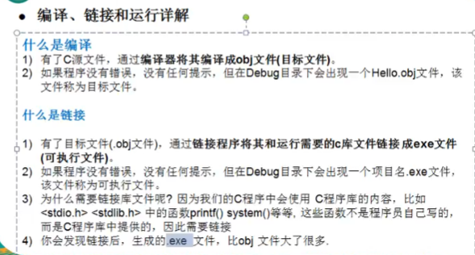
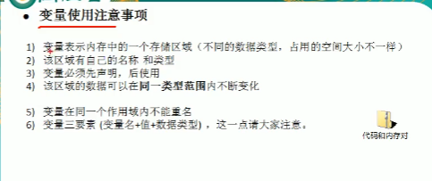
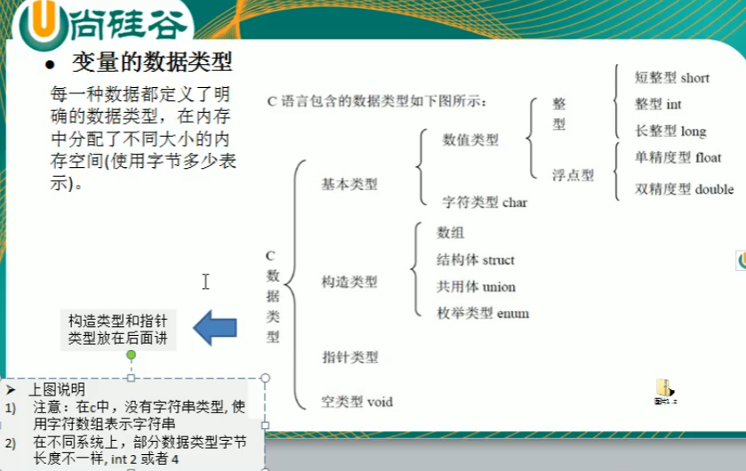
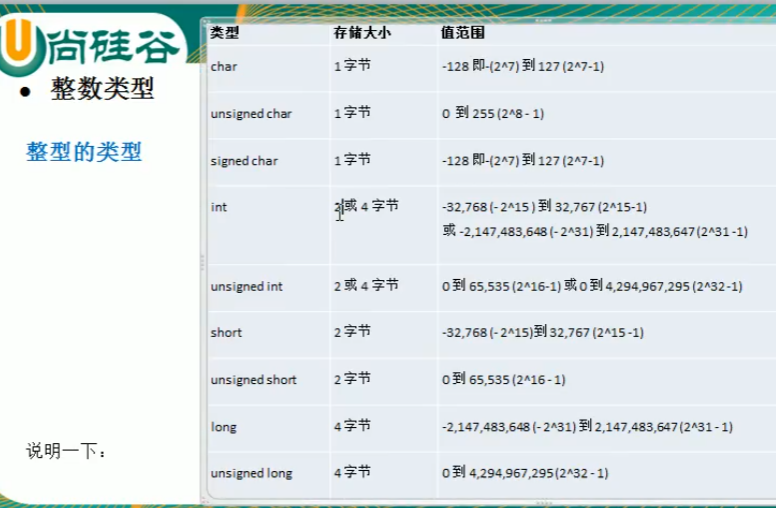

## 程序

为了让计算机执行某些操作或解决某个问题而编写的一系列有序指令的集合

## c语言的诞生

1）为了unix操作系统，原来是汇编语言写的

1973年 改为c语言

2）c语言对其他语言影响（c++ java php .......）

3)学好c 方便学习其他编程语言

## c语言发展历程

## c语言的特点

代码级别的跨平台

使允许直接访问物理地址 对硬件进行操作

c语言

## c程序运行机制

​	1）编辑：编写我们的.c 文件 就是源代码

​	2）编译：将 .c程序翻译成目标文件（.obj)+库文件//在计算机底层执行

​	3）链接: 将目标文件 .obj 生成可执行文件（.exe) //在计算机底层执行

​	4）运行： 执行.exe文件 得到运行结果

## 变量

变量相当于内存中一共数据存储空间的表示 你可以把变量看做是一个房间的门牌号

通过门牌号我们可以找到房价 而通过变量名可以访问到变量值

### 变量的数据类型

每一种数据都定义了明确的数据类型，在内存中分配了不同大小的内存空间

